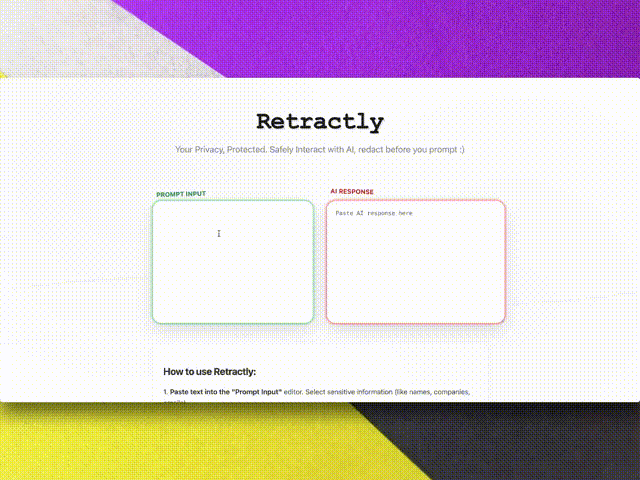

# Retractly - Privacy-First AI Prompting Tool

<p align="center">
  
</p>

<p align="center">
  <strong>Never lose control of your sensitive data when using AI tools like ChatGPT.</strong>
</p>

<p align="center">
  <a href="https://rjn32s.github.io/retractly/"><strong>Try Retractly Now</strong></a> · 
</p>


---

## The Problem

Every time you use ChatGPT, Claude, or other AI tools with sensitive data:
- ❌ Your private information leaves your control forever
- ❌ Temp/incognito chats still send data to AI servers
- ❌ Names, emails, company data become part of training datasets
- ❌ No way to verify what's actually being sent

**You're forced to choose between privacy and productivity.**

---
## ✨ The Solution
Retractly

Retractly gives you **both**:
```
You type:     "Draft an email to sarah.jones@acmecorp.com about the Q4 budget"
AI sees:      "Draft an email to [EMAIL_1] about the [TOPIC_1]"
You get back: Full response with sarah.jones@acmecorp.com and Q4 budget restored
```

### How It Works

1. **Select & Tag** - Highlight sensitive text (names, emails, companies)
2. **Auto-Redact** - Retractly replaces with placeholders (`[NAME_1]`, `[EMAIL_1]`)
3. **Prompt AI** - Send the sanitized version to ChatGPT/Claude/etc.
4. **Restore Locally** - Paste response back, Retractly auto-restores original data

**The AI never saw your real information.** But you got the full, contextualized answer.

---
